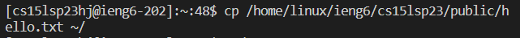

# How to into your Course-Specifc Account
Written by Julia Berdeski
***
## Installing VSCode
1. You need to go to the [VCS webiste](https://code.visualstudio.com/)
2. On there should be instructions on how to download and set up VCS

*It should look like this:*


## Remotely Connecting
In this section you will learn how to connect to a **remote** server that you can run code on.
1. Open up VCS if you have not done so already

**Extra Step for Windows Users**
> Intstall `git` for Windows 
> [Download](https://gitforwindows.org/)
>
> Once installed [these steps](https://stackoverflow.com/a/50527994) will help you set it up.

2. Open up a bash terminal by clicking on the + in your terminal 
3. Next you will want to use `ssh` followed by your account name and "@ieng.ucsd.edu"
- It should look something like this: `cs15lsp23zz@ieng6.ucsd.edu`
> You may get a message that looks like: 
> ```
> ssh cs15lsp23zz@ieng6.ucsd.edu
> The authenticity of host 'ieng6.ucsd.edu (128.54.70.227)' can't be established.
> RSA key fingerprint is SHA256:ksruYwhnYH+sySHnHAtLUHngrPEyZTDl/1x99wUQcec.
> Are you sure you want to continue connecting (yes/no/[fingerprint])? 
> ```
> This is because it is your first time logging onto the server.
> To continue type `yes`.
4. You will then be prompted to input your password (Keep in mind while it may not show that you are typing; you are).

**Once successfully logged in, you should see:**


## Running Some Commands
There are many commands that you can test to ensure you have properally set everything up. 
Some commands include:
- `pwd`
- `cd` 
- `ls`
- `cp`
- `cat`

just to name a few.

`pwd` stands for "Print Working Directory" and is a command that displays the working directory.


`ls <path>` is best related to "list" and is used to list the files and folders in a given path.


`cat` is typically used to show the contents of a file or files


`cp` can stand for "copies", since this command creates copies of files/ directories 



> You won't see any difference right away but can now refer to the directory/ files.


`cd` changes the directory 


> `..` is used to go back one
>
> 


